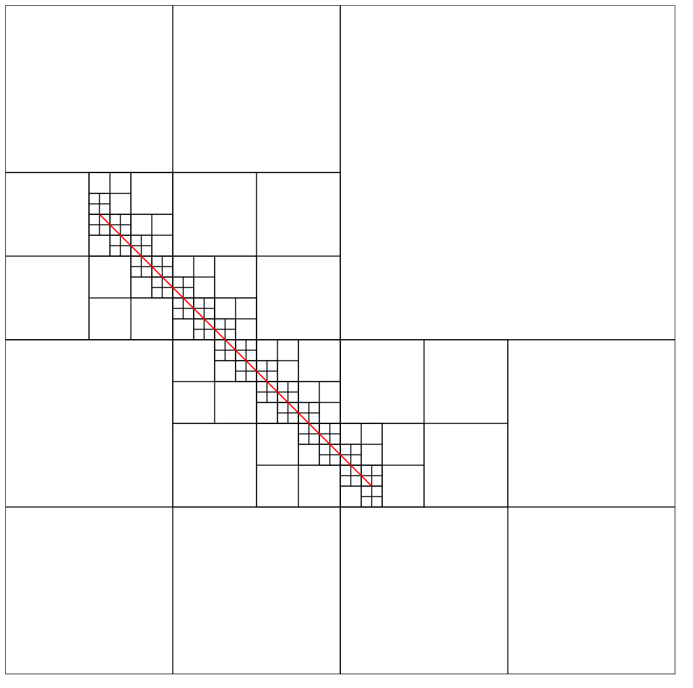
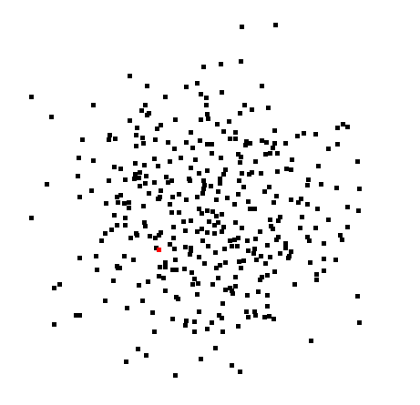
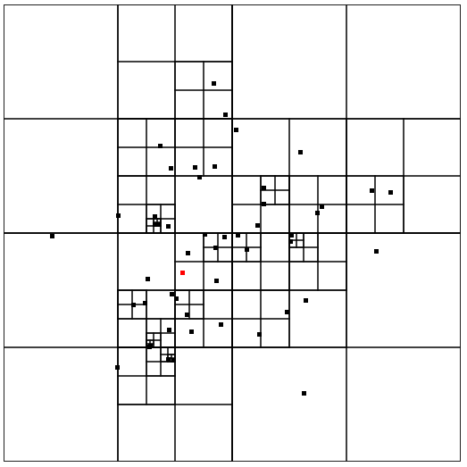
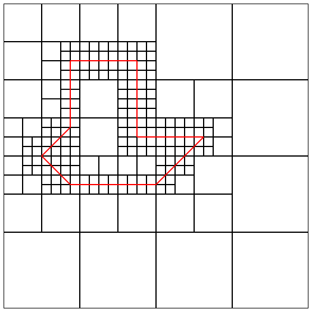

<!-- $size: 4:3 -->
# Quadtrees

---
# Motivation

 
Wie findet man die Nachbarn zum roten Punkt <i>schnell<i>

---
# Übersicht
| ||
|:-:|:-:|
| für Punktverwaltung | für Geometrie Umfassung|

<!-- page_number: true -->
<!-- footer: Nicklas Dohrn - Quadtrees - Proseminar Algorithmische Geometrie -->

---
# Aufbau eines Quadtree

