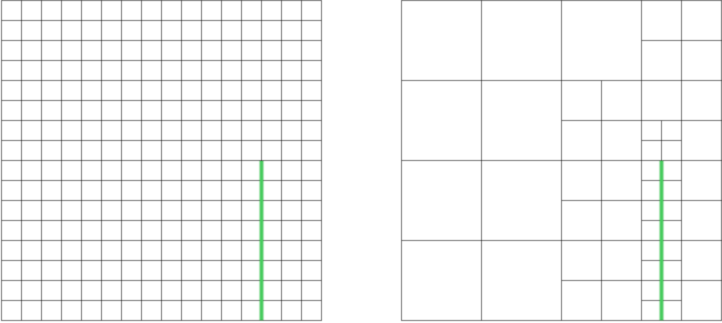

<!-- $size: 4:3 -->
# Quadtrees


---
# Motivation


Wie findet man <i>schnell</i> die Nachbarn zum roten Punkt 


<!-- page_number: true -->
<!-- footer: Nicklas Dohrn - Quadtrees - Proseminar Algorithmische Geometrie -->

---
# Übersicht
| ||
|:-|:-|
| Punktverwaltung | Geometrie|

---
# Aufbau eines Quadtree

|  |   |
|:-|:-:|
| Rekursive Baumstruktur|Begriffs-Konventionen |

---

# Explizite rekursive Konstruktion

Wurzelknoten $\sigma_{root}$, allgemein:  $\sigma:=[x_\sigma:x_\sigma']\times[x_\sigma:x_\sigma']$
$\sigma_{NW},\sigma_{NO},\sigma_{SW},\sigma_{NO}$ sind Kinder von $\sigma$

Punkte $p\in P$ werden in den Kindern von $\sigma$ gespiechert:
$x_{mid}:=\frac {x_\sigma+ x_\sigma'}{2}\space\space\space\space y_{mid}:=\frac {y_\sigma+ y_\sigma'}{2}$

$
P_{NW}:=\{p\space|\space p_x\leqslant x_{mid}\space \&\space p_y\leqslant y_{mid}\space \&\space p\in P\}
$
$
P_{NO}:=\{p\space|\space p_x>x_{mid}\space \&\space p_y\leqslant y_{mid}\space \&\space p\in P\}
$
$
P_{SW}:=\{p\space|\space p_x\leqslant x_{mid}\space \&\space  p_y > y_{mid}\space \&\space p\in P\}
$
$
P_{SO}:=\{p\space|\space p_x > x_{mid}\space \&\space p_y>y_{mid}\space \&\space p\in P\}
$

---

# Punkt einfügen
### Algorithmus

```js
function insertPoint (Tree t, Point p) {
  if(t.size <= UNITSIZE && t.point != null) return false
  
  if(t.childs == null && t.point == null) {
    t.point = p
  } else if(t.childs == null && t.point != null) {
    t.createChilds()
    t.insertPointToChilds(p)
    t.insertPointToChilds(t.point)
  } else {
    t.insertPointToChilds(p)
  }
  return true
}

```
---

# Punkt einfügen
## Laufzeit
### Satz
  
|<span style="font-weight:500"> Eine Quadtree der Tiefe $d$ , welcher  $n$ Punkte speichert, kann in der Zeit $O((d+1)n)$ erzeugt werden und hat $O((d+1)n)$ Knoten. </span>|
|:-|


---
# Nachbarn Finden


---
# Nachbarn Finden 
Richtung und Position zu Enum übersetzen:
  
``` js
Enum Pos = {NW=0, NO=1, SW=2, SO=3}
Enum Direction = {NORTH=0, EAST/OST=1, SOUTH=2, WEST=3}

//getInsideNeighbour
function gINeighbour (Direction d, Position t) {
    return <correctDirection>
}
  ``` 
  
|<span style="color:green; font-weight:500">gINeighbour(NORTH, Pos.SW)<br> return  Pos.NW </span><br><br><span style="color:red; font-weight:500">gINeighbour(NORTH, Pos.N0)<br> return -1 (no Neighbour found)</span>| |
|:-|:-:|

---
# Nachbarn Finden
Richtung und Position zu Enum übersetzen:

```js
Enum Pos = {NW=0, NO=1, SW=2, SO=3}
Enum Direction = {NORTH=0, EAST/OST=1, SOUTH=2, WEST=3}

//getOutsideNeighbour
function gONeighbour (Direction d, Position t) {
	return <correctDirection>
}
```
|<span style="color:red; font-weight:500">gONeighbour(NORTH, Pos.SW)<br> return -1 //no Neighbour found</span><br><br><span style="color:green; font-weight:500">gONeighbour(NORTH, Pos.N0)<br> return Pos.S0</span>| |
|:-|:-:|

---
# Nachbarn Finden
### Algorithmus

```js
Enum Direction = {N = 0, O = 1, S = 2, W = 3}
Enum Pos = {NW = 0, NO = 1, SW = 2, SO = 3}

function findNeighbour(Tree t, Direction d) {
  if(t.parent == null) return null;
  
  else if(gINeigbour(d, t.position) != -1) {
    return t.parent.childs[gINeigbour(d, t.position)
  } else {
    out = t.parent.getNeighbour(d)
    if(out == null || out.childs == null) {
      return out
    } else {
      return out.childs[gONeighbour(d, t.position)
} } }

```
---
# Nachbarn Finden
## Laufzeit
### Satz
|<span style="font-weight:500">Sei $T$ ein Quadtree der Tiefe $d$, so kann für einen Knoten $v$ der Nachbar in gegebener Richtung in $O(d+1)$ gefunden werden.</span>|
|:-|

---
# Balancieren eines Quadtrees


Grafische Darstellung

---
# Balancieren eines Quadtrees


Baumdarstellung

---
# Balancieren eines Quadtrees
### Algorithmus
```js
function balance(QTree root) {
  List l = root.getLeavesRecursive();
  for (Qtree t in l){
    for(direction = 0; direction < 4, direction++) {
      neighbour = t.getNeighbour(direction)
      if(neighbour != null && neighbour.childs != null){
      	if(smallChildsAdjacent(neighbour,direction)) {
          t.addChilds()
          l.append(t.getChilds())
          l.append(getNeighboursWithoutChilds(t))
        
          if(t.point != null) 
            t.insertPointToChilds(t.point)
          break;
} } } } }
```

---
# Balancieren eines Quadtrees
## Laufzeit
### Satz
|<span style="font-weight:500">Sei $T$ ein Quadtree mit $m$ Knoten, dann hat der balancierte Quadtree $T'$ $O(m)$ Knoten und kann in $O((d+1)m)$ aus $T$ konstruiert werden.</span>|
|-|

---
# Netzkonstruktion mit Quadtrees


---
# Netzkonstruktion mit Quadtrees
### Bedingungen und Vorgaben:
- Polygon Ecken haben nur die Winkel 0°, 45°, 90° und 135°.
- Es wird, wenn möglich, ein nicht-uniformes Netz erzeugt
- Ein Quadtree, der eine Kante eines Polygons enthält, wird aufgeteilt, bis das Kind mit der Polygonkante Minimalgröße hat.
- Das gewünschte Netz muss aus einem Balancierten Graphen erzeugt werden.


---

# Netzkonstruktion mit Quadtrees
### Polygone haben nur bestimmte Winkel


Polygonkante schneidet Quadrate an Seiten

---

# Netzkonstruktion mit Quadtrees
### Es wird ein nicht-uniformes Netz erzeugt



Nicht-uniformes Netz unnötig aufwändig


---
# Netzkonstruktion mit Quadtrees
### Es wird bis auf Minimalgröße aufgelöst


Polygonkante schneidet Quadrate an Seiten


---
# Netzkonstruktion mit Quadtrees
### Erzeugung aus balanciertem Graph


Unbalancierte Netzberechnung erzeugt unvollständiges Netz


---
# Netzkonstruktion mit Quadtrees
### Algorithmus
```
function insertLine (Qtree t, Line l) {
  if(t.size <= UNITSIZE) {
    if(lineCrossesSquare(t, l) || lineTouchesNorW(t,l));
      t.insertLineSegment(l);
    return;
  }
  if(this.childs != null) {
    t.insertLineInChilds(l);
  } else if(lineIntersectsSquare(t,l) {
    t.addChilds();
    t.insertLineInChilds(l);
  }
}
```


---
# Netzkonstruktion mit Quadtrees
## Laufzeit
### Satz
|<span style="font-weight:500">Sei $M$ ein Menge disjunkter polygonaler Komponenten im Quadrat $[0:U]\times[0:U]$, mit den vorher genannten Anforderungen, so lässt sich ein Netz mit $O(p(S)\log U)$ Dreiecken für M erzeugen. Hierbei ist $p(S)$ die Summe der Perimeter der Komponenten von $M$, und das Netz kann in $O(p(S)\log^2U)$ erzeugt werden.</span>|
|-|

---
# Sources
### Books
Mark de Berg, Otfried Cheong, Marc van Kreveld, and Mark Overmars (2008). Computational Geometry (3rd revised ed.). Springer-Verlag. ISBN 3-540-77973-6. 1st edition (1997): ISBN 3-540-61270-X
### Algorythms
https://stackoverflow.com/questions/9043805/test-if-two-lines-intersect-javascript-function Line Intersection von Dan Fox
### Images 
created with https://www.draw.io/ (licence free)


